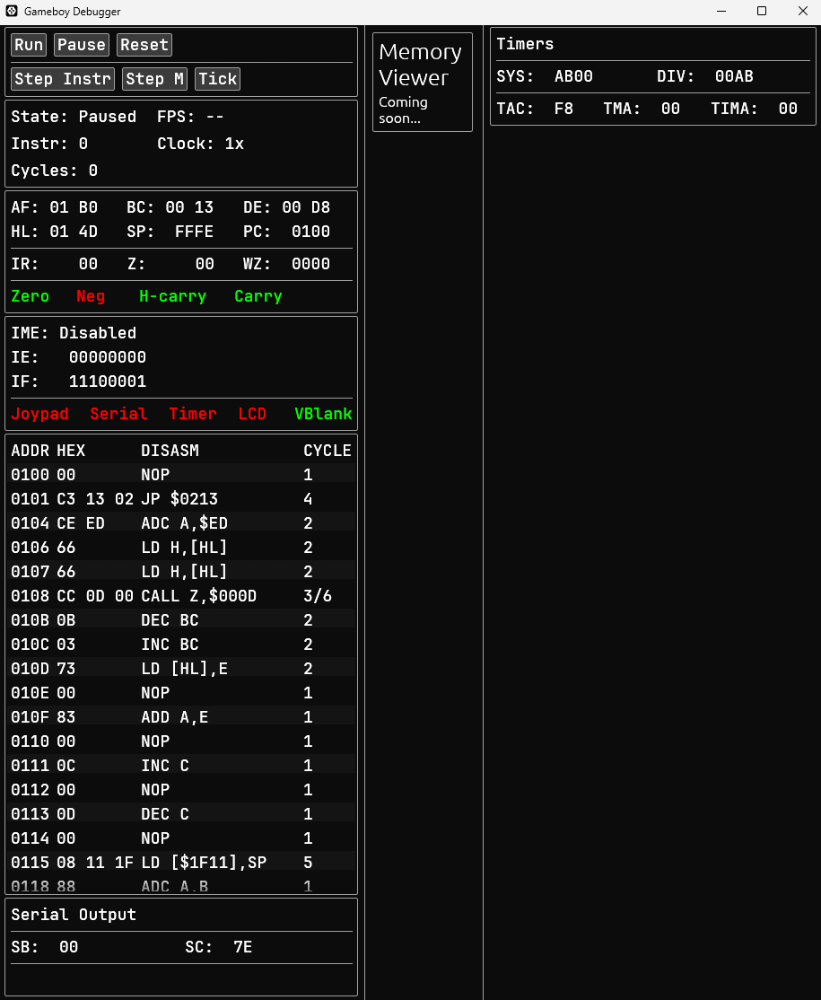

## DaVinci GB

DaVinci GB is a gameboy color emulator in active development. 

## CPU

The CPU implementation is complete, and passes all Blargg cpu_instrs test ROMs. The CPU is machine-cycle (M-cycle) accurate. The accompanying debugger UI was used to debug different ROMs and test cases. Here is a snapshot of the debugger UI, which allows users to pause execution, step by instruction or machine-cycle and view registers and disassembly:

## Current Work

I am currently working on the PPU implementation. My goal is to emulate a timer-cycle (T-cycle) accurate PPU. During this process I also refactored my bus implementation. This includes writing basic implementations for IO devices like cartridges, joystick, HRAM, VRAM etc.

As I work on refactoring the Bus and reimplementing memory devices, some implementations may not function as expected. For example, by implementing a memory controller with no MBC, only 32KiB ROMs can currently run on my system.

